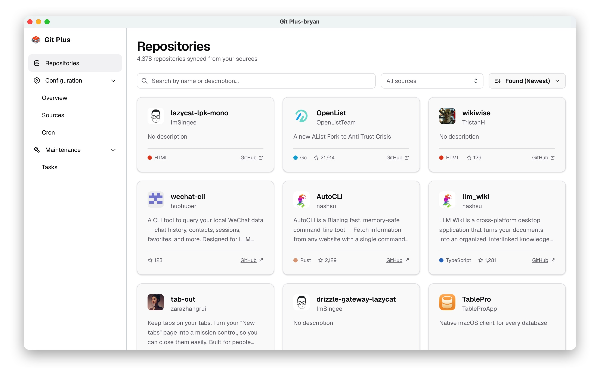
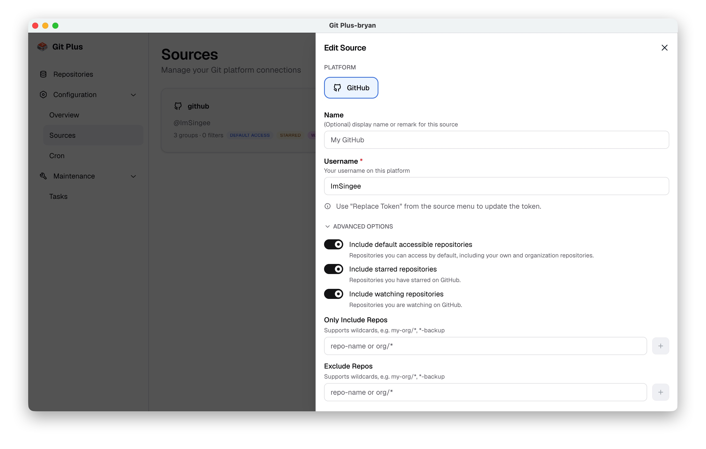
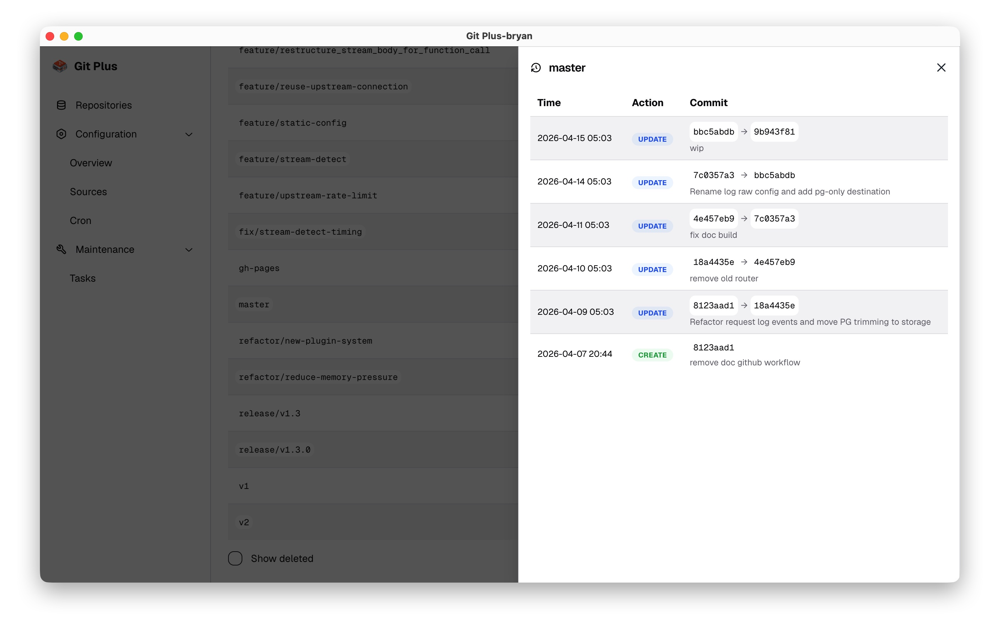

# git-plus

`git-plus` is a tool for backing up your GitHub repositories with a simple web-based workflow.

> Spoiler: the project will soon support more git-repository-based features, which is why it is called `git-plus` instead of `git-backup`.

## Highlights

1. Crafted dashboard experience for browsing repositories, sync state, and history in one place.



2. Backs up your own repositories, starred repositories, and watched repositories. This covers both sides of the problem: preserving code you wrote in case your account is suspended or lost, and preserving repositories you follow in case they are deleted, rewritten, or otherwise changed unexpectedly.



3. Records the full history of branch-head commit changes, not just the latest snapshot. This makes it possible to trace accidental force-pushes, overwritten branches, and upstream incidents without relying on manual `git reflog` recovery or guessing commits by time.



## Quick start

1. Set a secret used to encrypt tokens:

```bash
openssl rand -base64 32
export ENCRYPTION_PASSPHRASE='paste-the-generated-value'
```

2. Set a dashboard password:

```bash
export PASSWORD='choose-a-strong-password'
```

3. Start the server:

[Binary](https://github.com/ImSingee/git-plus/releases):

```bash
./git-plus --data-dir ./data
```

[Docker](https://github.com/ImSingee/git-plus/pkgs/container/git-plus):

```bash
docker run -d \
  --name git-plus \
  -p 8080:8080 \
  -v "$(pwd)/data:/data" \
  -e ENCRYPTION_PASSPHRASE='choose-a-random-secret' \
  -e PASSWORD='choose-a-strong-password' \
  ghcr.io/imsingee/git-plus:latest \
  --data-dir /data
```

4. Configure the dashboard at `http://localhost:8080`:
   1. Go to `/config/sources` and add a source.
   2. (Optional) Go to `/config/cron` and add a scheduled sync task if you want automatic pulling.
   3. (Optional) Go to `/maintenance/tasks` and click `Sync All` to run the first sync immediately.

## CLI usage

Show help:

```bash
./git-plus --help
```

Main server command:

```text
git-plus [flags]
```

Flags:

- `--data-dir string`
  - Required.
  - Directory for runtime data.
  - The config file is expected at `<data-dir>/config.yaml`.
- `--listen, -l string`
  - Listen address.
  - Default: `:8080`
  - If omitted, `PORT` is used when present.
- `--auto-migrate`
  - Whether to run embedded database migrations before startup.
  - Default: `true`

Subcommands:

- `git-plus db migrate --data-dir <dir>`
  - Runs embedded database migrations.

## Environment variables

### Required for server startup

- `ENCRYPTION_PASSPHRASE`
  - Required before the server command starts.
  - Used to validate encrypted tokens in `<data-dir>/config.yaml`.
- `PASSWORD`
  - Required before the server command starts.
  - Dashboard password used to protect all APIs mounted under `/api`.
  - Clients should send it with `Authorization: Bearer <PASSWORD>`.
  - Special case: if set to `insecure-noauth`, API authentication is disabled and startup prints a warning.

### Optional

- `PORT`
  - Used as the listen port when `--listen` is not provided.

## Configuration

The runtime config file lives at:

```text
<data-dir>/config.yaml
```

The top-level config includes `concurrency`, `max_retry_times` (default retry count: `2`), and an optional 5-field `cron` schedule. Each source can include default accessible repositories, starred repositories, and watching repositories in addition to explicit include/exclude repo filters.

In most cases, you do not need to edit this file manually; just open the page in your browser.
